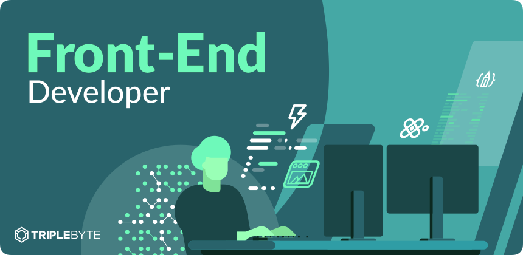

<div align="center">
  
  <p><strong>Roadmap to becoming a Front-End Developer in 2023.</strong></p>
</div>

---

<h1 align="center">:dart: Roadmap to boost your career</h1>

---

###BASIC TOOLS 

- [code editor vs code]("https://code.visualstudio.com/download")
- [Browser google chrome]("https://www.google.com/chrome/")
- [Git Handbook -Github guides &nbsp; :page_facing_up: ](https://guides.github.com/introduction/git-handbook/)

###content and learning resources

#HTML:

HTML stands for Hypertext Markup Language. It is the markup language for building web pages, it is also the building block of the web. HTML is easy to learn and comprehend. With just HTML, you can build a basic website.

- [Learning resources and tools for HTML - Front-End Masters](https://frontendmasters.com/guides/learning-roadmap/html/)
- [HTML Crash Course For Absolute Beginners - Traversy Media](https://www.youtube.com/watch?v=UB1O30fR-EE)
- [HTML Full Course - Freecodecamp](https://youtu.be/pQN-pnXPaVg)
---

#CSS:

CSS stands for Cascading Style Sheets. It is the technology to learn after HTML. It is used for styling our HTML. For example, we can use CSS to space our content, colours, fonts, etc.

- [MDN - CSS](https://developer.mozilla.org/en-US/docs/Learn/CSS)
- [Web.dev - Learn CSS](https://web.dev/learn/css/) ```recommended```
- [Web.dev - Learn Responsive Design](https://web.dev/learn/design/) ```recommended```

#CSS Frameworks:

**UI + Utility Toolkits**
- [Bootstrap ](https://getbootstrap.com/)
- [Bootstrap 5 Tutorial 🎬 🔠 🎬](https://www.youtube.com/playlist?list=PLnD96kXp-_pMJp3stPetkN76AJ2mmeah7) 
- [Bootstrap 5 Crash Course | Website Build & Deploy 🎬](https://youtu.be/4sosXZsdy-s)
- [Tailwind CSS 📖](https://tailwindcss.com/)
---

#JAVASCRIPT:

JavaScript is one of the most popular programming languages in the world. It is the language of the web. As a front-end developer, it is required you learn JavaScript. JavaScript enables us to create dynamic content. When you create your HTML structure and your style with your CSS, JavaScript makes the website dynamic and alive.

- [JavaScript Fundamentals](https://frontendmasters.com/guides/learning-roadmap/javascript-fundamentals/)
- [DOM Manipulation & BOM](https://frontendmasters.com/guides/learning-roadmap/dom-bom-cssom/)

- AJAX, Fetch API and JSON
- [ES6+ & Modular JS](https://frontendmasters.com/guides/learning-roadmap/javascript-modules-scripts/)
- [Web APIs](https://developer.mozilla.org/en-US/docs/Web/API)
- [Object-oriented Programming (OOP)](https://frontendmasters.com/guides/learning-roadmap/js-oop/)
- [Regular Expressions (Regex)](https://frontendmasters.com/guides/learning-roadmap/javascript-regular-expressions/) `general skill`
- [JavaScript Tutorial for Beginners - Programming with Mosh :clapper:](https://youtu.be/W6NZfCO5SIk)
- [JavaScript Tutorial for Beginners - Clever programmers :clapper:](https://youtu.be/Qqx_wzMmFeA)

**javascript library**
- [REACT.JS]("https://reactjs.org/")
- [REACT.JS tutorial]("https://www.youtube.com/watch?v=w7ejDZ8SWv8")

# Modern JavaScript:
In this section you will learn how to use package managers and get started with the "modern JavaScript".

## Resources:
- [What is NPM and how to use it](https://www.youtube.com/watch?v=8Rmj5UY5mJk)

- [NPM Crash Course](https://www.youtube.com/watch?v=jHDhaSSKmB0)


